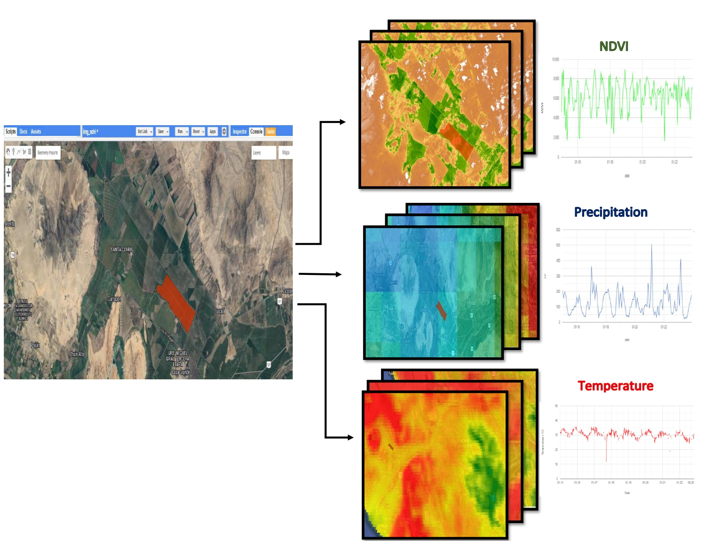

# Sparsity Regularization and Causality in Agricultural Yield: The Case of Paddy Rice in Peru
## About the project
This study introduces a novel approach that integrates agricultural census data with remotely sensed time series to develop precise predictive models for paddy rice yield across various regions of Peru. By utilizing sparse regression and Elastic-Net regularization techniques, the study identifies causal relationships between key remotely sensed variables—such as NDVI, precipitation, and temperature—and agricultural yield.
To further enhance prediction accuracy, the first- and second-order dynamic transformations (velocity and acceleration) of these variables are applied, capturing non-linear patterns and delayed effects on yield. The findings highlight the improved predictive performance when combining regularization techniques with climatic and geospatial variables, enabling more precise forecasts of yield variability. The results confirm the
existence of causal relationships in the Granger sense, emphasizing the value of this methodology for strategic agricultural management. This contributes to more efficient and sustainable production in paddy rice cultivation.

## Materials and Methods
### Area of study
me use paddy rice production in Peru as a case study for our methodologies. Several regions in Peru were selected as study areas, focusing on those with the highest concentrations of paddy rice production. The primary source of information for this analysis comes from the agricultural censuses conducted in Peru between 2015 and 2018, which provide detailed and up-to-date data on farming practices and characteristics (see Plataforma Nacional de Datos Abiertos, (2024)).

### Remote sensing data
Satellite images used in this study were acquired through remote sensing and processed using open-access tools such as Google Earth Engine (GEE). On this platform, radiometric and atmospheric corrections were applied, and cloud-induced variability was managed to ensure high-resolution images. In addition, key remote sensing variables that significantly influence crop development and yield were identified and selected, such as Normalized Difference Vegetation Index (NDVI), precipitation (PREC) and temperature (TEMP).

### Data preprocessing
Once the remotely sensed data and relevant agricultural census data were extracted, it was crucial to ensure robust temporal consistency and uniform quality and frequency before proceeding with the analysis. To achieve this, a Spline interpolation process was implemented, allowing the establishment of a weekly frequency in the NDVI, PREC, and TEMP. This process not only enhanced the accuracy in capturing the temporal variability of the data, but also enabled the division of the data into twelve lags, referred to as lags, for the NDVI, Precipitation, and Temperature variables. As a result, after interpolation, the three remote sensing variables are provided as time series with a weekly frequency.

## Modeling Phase
The final dataset considered for this study is composed of $D = \{(x_i, y_i)\}_{i=1}^N$, where $N = 348$ represents the number of sampled plots. Here, the response variable $y_i \in \mathbb{R}$, labeled as Prod-Hect, denotes the agricultural yield of the crop, measured in tons per hectare, where the harvest occurred in week $T_i$. Additionally, the covariate vector $x_i \in \mathbb{R}^{81}$ consists of two groups of variables.

### Regression with Elastic-Net Regularization

### Gradient Tree Boosting
Let $q: \mathbb{R}^{81} \rightarrow T$ represent the structure of a tree that maps the characteristics of a crop $x_i$ to the index of the corresponding leaf. The weight vector of its leaves is given by $\omega = (\omega_1, \ldots, \omega_{|T|}) \in \mathbb{R}^{|T|}$, where $\omega_k$ denotes the score of the k-th leaf. Here, $T$ is the set of leaves of the tree, and $|T|$ indicates the total number of leaves. To obtain the prediction of agricultural yield $\hat{y}_i$, we will use an additive ensemble $\kappa$ of these trees, denoted by $\phi$, which can be expressed as follows:
\[
\hat{y}_i = \phi(x_i) = \sum_{k=1}^{\kappa} f_k(x_i), \quad f_k \in F
\]
where $F = \{ f: \mathbb{R}^{81} \rightarrow \mathbb{R} \mid f(x_i) = \omega_{q(x_i)} \}$ denotes the space of regression trees, also known as CART (see Breiman et al., 1984). It is important to note that each $f_k$ corresponds to an independent tree structure $q$ with its associated leaf weights $\omega$.

### Semi-parametric Additive Model
